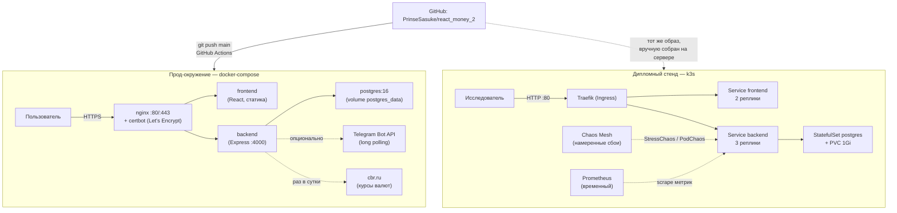

# Архитектура

react-money существует в **двух параллельных, не связанных друг с другом окружениях**: прод (docker-compose на выделенной VPS) и дипломный исследовательский стенд (k3s-кластер на отдельной VPS). Они запускают один и тот же образ приложения, но с разными целями — прод обслуживает реальных пользователей, стенд существует ради экспериментов с отказоустойчивостью и не трогает прод никогда.

## Почему они разделены

- **Разная цель.** Прод должен быть стабилен и доступен для пользователей. Стенд существует, чтобы его намеренно ломали (Chaos Mesh) — совмещать эти две задачи на одной инфраструктуре означало бы рисковать реальными данными пользователей ради экспериментов.
- **Разный уровень оркестрации.** Прод — простой `docker-compose up -d`, этого достаточно для одного сервера без требований к самовосстановлению нескольких реплик. Стенд — полноценный Kubernetes (k3s), потому что тема диплома требует именно self-healing на уровне оркестратора (Deployment/StatefulSet, readiness/liveness-пробы), а не просто `restart: unless-stopped`.
- **Общее — только образ приложения.** Backend и frontend собираются из одного и того же кода, но на стенде — вручную (`docker build` прямо на сервере, без внешнего registry) и деплоятся через Kubernetes-манифесты (`k8s/*.yaml`), а не через `docker-compose.yml`.

Подробности по каждому окружению — в [05-deployment.md](./05-deployment.md) (прод) и [06-k8s-stand.md](./06-k8s-stand.md) (стенд).

## Технологический стек

| Слой | Технология | Почему выбрана |
|---|---|---|
| Frontend | React 18 + `react-router-dom` v6 | SPA с клиентской маршрутизацией и защищёнными роутами (`ProtectedRoute`) — стандартный, некастомный выбор для этого масштаба приложения |
| Стили | SCSS-модули (`*.module.scss`) + CSS-переменные для тем | CSS-переменные позволяют переключать светлую/тёмную тему через один атрибут `data-theme` на `<html>`, без runtime-перекомпиляции стилей |
| Графики | `react-google-charts` (прогноз бюджета) | Готовый LineChart с поддержкой двух серий (факт + прогноз) без написания SVG/canvas-рендеринга руками |
| Backend | Express (Node.js) | Минимум абстракций поверх HTTP — для API такого размера (9 групп роутов) полноценный фреймворк вроде NestJS был бы избыточен |
| Авторизация | JWT (свой, не Firebase/OAuth) | Сознательный отказ от внешней зависимости (Firebase) при переходе на собственный backend — токен живёт в `localStorage`, 30 дней, проверяется middleware `requireAuth` |
| База данных | PostgreSQL 16 | Данные по природе реляционные (пользователь → счета → транзакции → вложения, все со строгими FK) — не документная модель; `NUMERIC(14,2)` для денег (не `float`, чтобы не терять точность в копейках) |
| Файлы (вложения) | Локальный volume (`uploads_data`), не S3 | Один сервер, нагрузка на файлы небольшая (чеки/квитанции) — выделенное объектное хранилище было бы преждевременной сложностью на этом масштабе |
| Курсы валют | Прямой фид ЦБ РФ (`cbr.ru/scripts/XML_daily.asp`), кэш в своей таблице | Официальный бесплатный источник без ключей API; кэш нужен, чтобы не дёргать ЦБ на каждый запрос фронта |
| Экспорт | `xlsx` + `pdfkit` (с шрифтом DejaVu Sans) | Оба формата, которые реально просят пользователи финансовых трекеров; DejaVu — потому что встроенный в pdfkit Helvetica не умеет кириллицу |
| Telegram-бот | `node-telegram-bot-api`, long polling | Простейший способ подключить бота без публичного HTTPS-эндпоинта под вебхук (webhook потребовал бы отдельного домена/сертификата для бота) |
| Тесты (backend) | Jest + Supertest | Стандартная пара для Node/Express, юнит- и интеграционные тесты в одном раннере |
| Тесты (e2e/визуальные/a11y) | Playwright + `@axe-core/playwright` | Один инструмент закрывает функциональные e2e, визуальные регрессии (`toHaveScreenshot`) и accessibility-проверки (axe) — не нужно три разных фреймворка |
| Прод-оркестрация | Docker Compose | Один сервер, 5 сервисов, нет требования к горизонтальному масштабированию — Kubernetes здесь был бы избыточен |
| Дипломный стенд | k3s (облегчённый Kubernetes) | Тема диплома требует именно оркестратор с self-healing на уровне контроллеров, а не просто `restart` — k3s даёт это на одной небольшой VPS без затрат полноценного multi-node кластера |
| CI/CD | GitHub Actions | Бесплатно для публичного репозитория, встроенная интеграция с GitHub без дополнительных сервисов |
| Хаос-инжиниринг | Chaos Mesh | CNCF-проект, декларативные манифесты (`PodChaos`, `StressChaos`) как часть обычных k8s-ресурсов — не отдельный внешний сервис |
