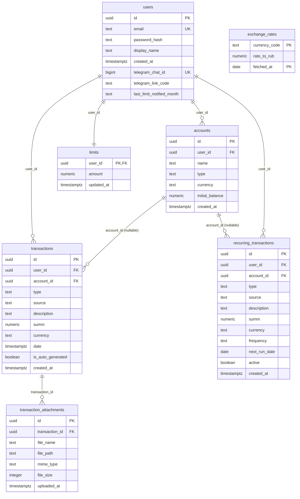

# Схема базы данных

PostgreSQL 16. Актуальная схема — `backend/migrations/init.sql`, применяется автоматически при каждом старте backend-контейнера (`node src/migrate.js && node src/index.js`, см. `backend/Dockerfile`).

## ER-диаграмма

`exchange_rates` не связана с остальными таблицами по FK — это справочный кэш курсов валют, ключ (`currency_code`, `fetched_at`) сам по себе уникален и достаточен.

## Таблицы по отдельности

### `users`
Аккаунт пользователя. `email` уникален и всегда хранится в нижнем регистре (приводится на уровне `auth.js` перед запросом). `password_hash` — bcrypt, 10 раундов. `telegram_chat_id`/`telegram_link_code`/`last_limit_notified_month` добавлены позже отдельными `ALTER TABLE` — поддерживают привязку Telegram-бота и анти-спам для уведомлений о превышении лимита (не шлём одно и то же уведомление дважды за месяц).

### `accounts`
Счета пользователя (карта/наличные/сберегательный). `type` ограничен `CHECK` до `cash`/`card`/`savings`, `currency` — произвольный код (`RUB`/`USD`/`EUR` валидируются на уровне приложения в `accounts.js`, не в БД). Баланс счёта **не хранится** как поле — вычисляется на лету в `GET /api/accounts` как `initial_balance + SUM(доход) - SUM(расход)` по связанным транзакциям. При регистрации каждому пользователю создаётся счёт "Основной" (см. `auth.js`).

### `transactions`
Основная таблица. `type` — строго `'Доход'` или `'Расход'` (кириллица в `CHECK`, так исторически сложилось в исходном проекте). `account_id` — nullable с `ON DELETE SET NULL`: если счёт удаляют, транзакции не пропадают, просто теряют привязку к счёту (хотя на практике `DELETE /api/accounts/:id` сам не даёт удалить счёт с транзакциями без явного переноса — см. [03-backend-api.md](./03-backend-api.md)). `is_auto_generated` отличает транзакции, созданные крон-раннером повторяющихся платежей, от введённых вручную (на фронте — бейдж 🔁). Два индекса на `user_id` и `(user_id, date)` — под самый частый запрос: "все транзакции пользователя, отсортированные по дате".

**Почему `date` — `timestamptz`, а не `date`:** транзакция может быть добавлена задним числом с точным временем (для сортировки внутри одного дня имеет значение), и `timestamptz` сохраняет часовой пояс корректно независимо от того, в каком поясе находится сервер или клиент — простой `date` потерял бы и время, и информацию о поясе.

### `transaction_attachments`
Чеки/квитанции к транзакции. `file_path` — это **не** оригинальное имя файла, а сгенерированный UUID + расширение (см. `middleware/upload.js`) — оригинальное имя (`file_name`) хранится отдельно только для отображения, чтобы избежать коллизий и path traversal через специально сформированное имя файла. `ON DELETE CASCADE` от `transactions` — удалили транзакцию, вложения к ней исчезают из БД автоматически (сами файлы на диске удаляются отдельно, из кода приложения, не БД).

### `limits`
Один лимит расходов на пользователя в месяц. `user_id` — одновременно и первичный, и внешний ключ (жёсткое отношение 1:1 с `users`), поэтому у пользователя физически не может быть больше одного лимита. `PUT /api/limits` использует `INSERT ... ON CONFLICT (user_id) DO UPDATE` — не нужно отдельно проверять, существует ли уже запись.

### `recurring_transactions`
Шаблоны повторяющихся операций, из которых крон-раннер (`recurringRunner.js`, раз в сутки в 6:00) создаёт реальные строки в `transactions`. `frequency` — `daily`/`weekly`/`monthly`, `next_run_date` сдвигается раннером после каждого срабатывания. `active = false` — способ временно отключить шаблон, не удаляя его.

### `exchange_rates`
Кэш курсов ЦБ РФ, обновляется раз в сутки (`exchangeRates.js`, крон в 6:00 + один раз сразу при старте контейнера). Составной первичный ключ `(currency_code, fetched_at)` — по одной записи на валюту в день, `ON CONFLICT DO UPDATE` перезаписывает курс, если фид дёрнули повторно в тот же день.

## Механика миграций — важный неочевидный момент

В проекте **нет** отдельного каталога с пронумерованными миграциями (`001_init.sql`, `002_add_accounts.sql` и т.д.) — вся схема живёт в одном файле `backend/migrations/init.sql`, который целиком выполняется при каждом старте backend-контейнера.

Это работает только благодаря двум приёмам, которые нужно соблюдать при любом следующем изменении схемы:

1. **Новые таблицы** — `CREATE TABLE IF NOT EXISTS`. На уже существующей базе эта команда — no-op, ничего не ломает.
2. **Новые поля существующих таблиц** — **не** трогать исходный `CREATE TABLE` этой таблицы (он однажды уже выполнился на проде и больше не сработает повторно из-за `IF NOT EXISTS`), а дописывать `ALTER TABLE ... ADD COLUMN IF NOT EXISTS` отдельной строкой **после** исходного `CREATE TABLE`, там же, в `init.sql`. Так, например, добавлены `telegram_chat_id` на `users`, `account_id` на `transactions`, `is_auto_generated` на `transactions`.

Если добавить новое поле не через `ALTER TABLE ADD COLUMN IF NOT EXISTS`, а просто вписав его в середину существующего `CREATE TABLE` — на **новой** пустой базе оно появится, а на **уже существующей** проде — нет, потому что `CREATE TABLE IF NOT EXISTS` для уже существующей таблицы не выполнится вообще, и различие всплывёт только на проде, когда что-то обратится к несуществующей колонке.

**Порядок операторов в файле имеет значение** — `ALTER TABLE transactions ADD COLUMN account_id ... REFERENCES accounts(id)` физически не может выполниться раньше, чем `CREATE TABLE accounts`. Это уже один раз стало реальным багом (см. [07-testing.md](./07-testing.md) — блок про тесты, где сказано, что именно неверный порядок таблиц в `init.sql` ломал миграцию на чистой БД, найдено и исправлено).

Отдельно от `init.sql`, `backend/src/migrate.js` после применения SQL ещё выполняет `backfillDefaultAccounts()` — JS-функцию, которая идемпотентно создаёт счёт "Основной" для пользователей, у которых нет ни одного счёта (актуально для аккаунтов, заведённых до появления фичи счетов), и переносит на него их "бесхозные" транзакции.
