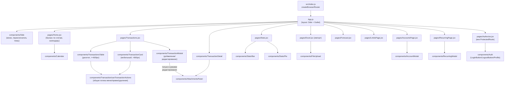

# Структура фронтенда

React 18, SPA, роутинг через `react-router-dom` v6 (`createBrowserRouter`), собирается `react-scripts` (Create React App), стили — SCSS-модули.

## Дерево страниц и компонентов

Все страницы, кроме `/login`, обёрнуты в `ProtectedRoute` (`components/Auth/ProtectedRoute.js`) — редиректит на `/login`, если пользователь не авторизован.

## Система тем

Тема хранится не в React-состоянии как таковом, а в DOM: атрибут `data-theme` на `<html>` плюс `localStorage`. Все цвета в SCSS завязаны на CSS-переменные (`src/index.css`), которые переопределяются в зависимости от `[data-theme="dark"]`.

`src/hooks/useTheme.js`:
- при монтировании читает тему из `localStorage` (дефолт — `"light"`);
- `toggleTheme()` переключает и сразу пишет атрибут `data-theme` на `document.documentElement` + обновляет `localStorage`;
- отдельный `MutationObserver` следит за изменением `data-theme` на `<html>` — это нужно, чтобы **все** компоненты, использующие `useTheme()` (хук может быть вызван в нескольких местах одновременно — например, и в `Side`, и в `Forecast.jsx` для цвета графиков), синхронно узнавали о переключении темы, даже если переключил не тот инстанс хука, в котором они сами вызвали `toggleTheme`.

Компоненты, которым нужен цвет темы программно (не через CSS), а не просто className — например, `Forecast.jsx` красит текст/сетку графика `react-google-charts` (эта библиотека не умеет читать CSS-переменные, ей нужны конкретные hex-значения в JS) — читают `theme` из хука и выбирают hex вручную (`isDark ? "#ececf1" : "#1b1d4e"`).

## Data flow

### `services/api.js` — единая точка обращения к backend
Все компоненты ходят к API только через этот модуль, никогда не вызывают `fetch` напрямую (кроме двух намеренных исключений — загрузка файла и скачивание экспорта, у которых другой Content-Type). Внутри — одна функция `request(path, options)`, которая:
- берёт токен из `localStorage`, добавляет `Authorization: Bearer <token>`, если он есть;
- парсит JSON-ответ, и если `response.ok === false` — бросает `Error(data.error)`, чтобы компоненты ловили её единообразным `catch`.

Отдельно — `uploadAttachment` (тело `FormData`, не JSON), `fetchAttachmentBlob` (превью/скачивание вложения — обязательно через `fetch` + Bearer-заголовок, а не ``, потому что у тега `` нет способа передать заголовок авторизации) и `downloadExport` (скачивание бинарного файла с созданием временной `<a download>`-ссылки).

### `AuthContext` — состояние авторизации
`context/AuthContext.js` оборачивает всё приложение (`AuthContextProvider` в `index.js`, снаружи роутера). При монтировании читает токен из `localStorage`, если есть — вызывает `GET /api/auth/me`, чтобы подтвердить, что токен ещё валиден, и получить актуальные данные пользователя; если невалиден — токен удаляется. Пока идёт эта проверка, `loading === true`, и `ProtectedRoute`/`App` показывают `"Loading..."`.

`loginUser`/`registerUser` — вызывают соответствующий метод `api.js`, сохраняют токен в `localStorage` и пользователя в состояние контекста. `logoutUser` — просто чистит оба.

### Где именно живёт JWT-токен
`localStorage.getItem("token")` / `localStorage.setItem("token", ...)` — читается при каждом запросе внутри `services/api.js` (не хранится в состоянии React отдельно от контекста пользователя). Обновляется при логине/регистрации, удаляется при логауте или если `GET /api/auth/me` вернул ошибку при старте приложения (истёкший/невалидный токен).

## Таблица маршрутов

| Путь | Компонент | Защищён `ProtectedRoute` |
|---|---|---|
| `/` | `pages/Home.jsx` | ✅ |
| `/transactions` | `pages/Transactions.jsx` | ✅ |
| `/transactions/date/:date` | `pages/Transactions.jsx` (та же страница, с фильтром по дате из URL) | ✅ |
| `/transactions/:id` | `components/TransactionDetail` | ✅ |
| `/login` | `pages/Authorize.jsx` | — |
| `/stats` | `pages/Stats.jsx` | ✅ |
| `/import` | `pages/Excel.jsx` | ✅ |
| `/forecast` | `pages/Forecast.jsx` | ✅ |
| `/limit` | `pages/LimitsPage.jsx` | ✅ |
| `/accounts` | `pages/AccountsPage.jsx` | ✅ |
| `/recurring` | `pages/RecurringPage.jsx` | ✅ |
