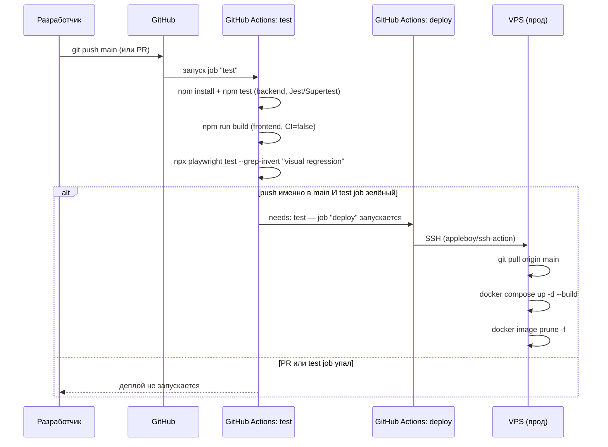

# Деплой и инфраструктура (прод)

Прод — одна VPS, `docker-compose.yml` в корне репозитория, 5 сервисов. Отдельно от дипломного k3s-стенда, см. [06-k8s-stand.md](./06-k8s-stand.md).

## CI/CD-пайплайн

`.github/workflows/deploy.yml`, один workflow, два джоба (`test` → `deploy`, второй зависит от первого через `needs:`).



Ключевые решения:
- **`test` гейтит `deploy`** — деплой физически не может запуститься, если backend-тесты или e2e упали.
- **`test` гоняется и на `pull_request`, и на `push` в `main`** — на PR деплоя нет (условие `github.event_name == 'push'`), только проверка; смысл — увидеть красный статус ещё до мержа.
- **Визуальные скриншоты (`visual.spec.js`) исключены из CI** — их baseline сгенерирован на Windows, а GitHub-раннер — Linux, разный антиалиасинг шрифтов дал бы постоянные лже-провалы. Прогоняются только локально (`npx playwright test`). Подробнее — [07-testing.md](./07-testing.md).
- **Frontend собирается с `CI=false`** — намеренно, чтобы совпадать с тем, как его реально собирает прод-`Dockerfile` (там `CI` не выставлена вовсе), а не с более строгим дефолтным поведением CRA, которое превращает ESLint-warning'и в ошибки сборки только под GitHub Actions.

## Сервисы `docker-compose.yml`

| Сервис | Образ | За что отвечает |
|---|---|---|
| `postgres` | `postgres:16-alpine` | БД, том `postgres_data`, healthcheck `pg_isready` — от него зависит старт `backend` (`condition: service_healthy`) |
| `backend` | собственный (`./backend/Dockerfile`) | Express API, том `uploads_data` под вложения (переживает пересборку контейнера) |
| `frontend` | собственный (multi-stage, корневой `Dockerfile`) | Сборка React в `nginx`-образ, `REACT_APP_API_URL` зашивается на этапе сборки как build-arg |
| `nginx` | `nginx:1.27-alpine` | Реверс-прокси на 80/443, раздаёт TLS-сертификаты из `certbot_certs` |
| `certbot` | `certbot/certbot` | Выпуск/продление Let's Encrypt-сертификатов, общий том с `nginx` |

**Честная оговорка:** `docker-compose.yml` монтирует `./nginx/conf.d` в контейнер `nginx`, но каталог `nginx/conf.d` **не существует в репозитории** (не закоммичен и не в `.gitignore` — просто отсутствует). Судя по всему, он создан вручную прямо на проде при изначальной настройке SSL через certbot и никогда не был добавлен в git. Это значит, что конфигурация nginx для прода сейчас не воспроизводима "с нуля" только из репозитория — при разворачивании на новом сервере этот каталог с конфигом виртуального хоста и путями к сертификатам нужно будет создать заново вручную (или запросить у того, кто исходно настраивал прод).

## Переменные окружения

`.env` в корне (не в git, см. `.env.example`):
```
REACT_APP_API_URL=...        # зашивается в сборку фронта
JWT_SECRET=...                # подписывает JWT backend'а
TELEGRAM_BOT_TOKEN=           # пусто = бот отключён
```

## Деплой с нуля на новом сервере

Пошаговая инструкция для локальной разработки и первого разворачивания через Docker уже есть в [корневом README.md](../README.md) ("Быстрый старт", "Локальная разработка без Docker") — не дублируется здесь. Дополнительно к тому, что там написано, для полноценного прод-разворачивания (не только локального) понадобится:

1. Всё из README (`.env`, `docker compose up --build`).
2. Вручную создать `nginx/conf.d/*.conf` с виртуальным хостом (см. оговорку выше — в репозитории этого файла нет).
3. Настроить certbot (`docker compose run certbot certonly ...`, стандартный флоу Let's Encrypt через webroot, `certbot_www`-том уже проброшен под challenge-файлы).
4. Добавить в GitHub Actions secrets: `VPS_HOST`, `VPS_USER`, `VPS_SSH_KEY`, `VPS_PROJECT_PATH` — без них джоб `deploy` не сможет подключиться по SSH.
