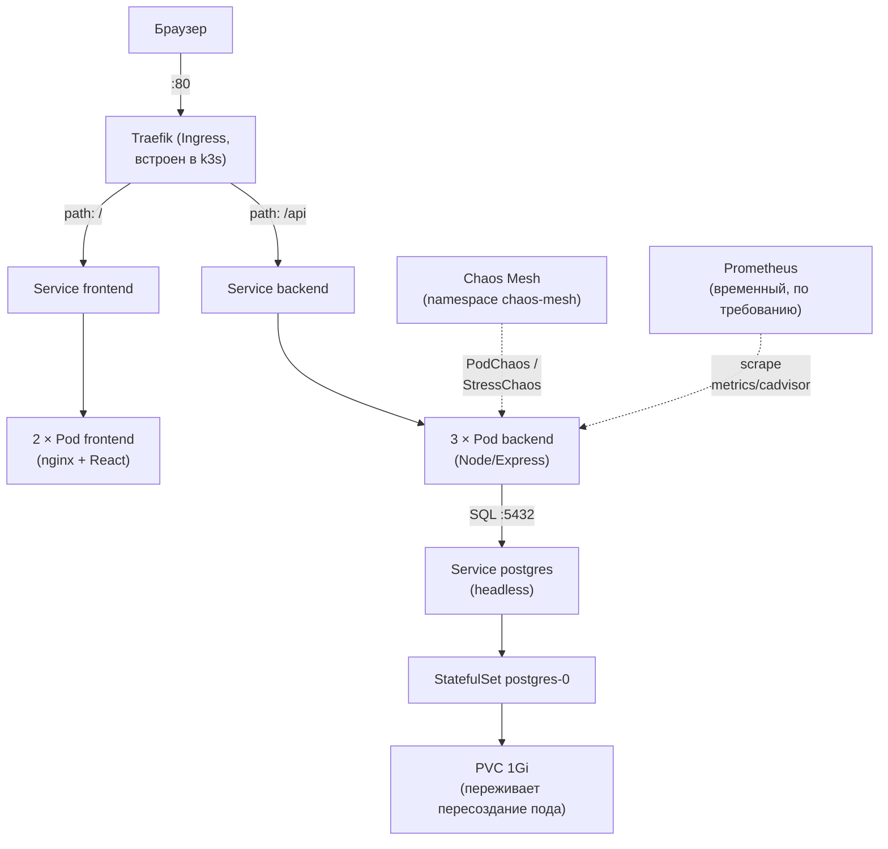

# Дипломный k3s-стенд

Отдельная VPS (`2.26.95.49`, Ubuntu 20.04.6 LTS, 2 vCPU/8GB), не прод. Существует ради экспериментальной части темы диплома «Разработка отказоустойчивой системы доставки приложений на основе Kubernetes с автоматическим восстановлением после сбоев и предиктивным обнаружением аномалий». Использует тот же образ приложения, что и прод, но развёрнутый через k3s (Kubernetes), а не docker-compose.

## Архитектура стенда

Что общее с прод-окружением: тот же код backend/frontend, тот же образ (собранный вручную на этой VPS через `docker build`, без внешнего registry — `imagePullPolicy: Never` во всех Deployment/StatefulSet манифестах, `k8s/*.yaml`). Что отличается: k3s вместо `docker-compose`, Traefik вместо `nginx`, StatefulSet+PVC вместо простого volume для Postgres, плюс два компонента, которых в проде вообще нет — Chaos Mesh (намеренные сбои) и Prometheus (метрики для предиктивного обнаружения, поднимается только на время экспериментов — не работает постоянно, из соображений экономии ресурсов на 2 vCPU/8GB).

## Self-healing: readiness/liveness-пробы

| Под | Проверка | initialDelay | period |
|---|---|---|---|
| backend | `httpGet /api/health :4000` | readiness 5с / liveness 15с | 5с / 10с |
| frontend | `httpGet / :80` | readiness 5с / liveness 15с | 5с / 10с |
| postgres | `exec: pg_isready -U app -d react_money` | readiness 5с / liveness 15с | 5с / 10с |

`readinessProbe` решает, можно ли уже слать поду трафик (Service временно исключает под из балансировки, если проба не проходит) — это не приводит к перезапуску. `livenessProbe` решает, не завис ли под настолько, что дешевле перезапустить контейнер целиком. У backend/frontend — 3 и 2 реплики соответственно (self-healing без простоя сервиса при потере одной реплики), у postgres — 1 реплика со StatefulSet (стабильное имя пода + отдельный PVC, данные переживают пересоздание пода).

## Проведённые эксперименты

### 1. Baseline self-healing (MTTR)

Метод: `kubectl delete pod <имя>`, секундомер — от удаления до появления нового пода в `Running`/`Ready`.

| Компонент | Реплик | MTTR | Простой сервиса |
|---|---|---|---|
| backend | 3 | **6.10 сек** | 0 — остальные 2 реплики держали трафик |
| postgres | 1 | **7.56 сек** | ~7.5 сек, данные не потеряны (PVC пережил пересоздание) |

Побочная находка при самом первом деплое: backend трижды ушёл в `CrashLoopBackOff` (стартовал раньше, чем postgres стал готов), и сам восстановился за ~25 сек без вмешательства — живой пример self-healing ещё до постановки Chaos Mesh экспериментов.

### 2. StressChaos — точечный скачок нагрузки

Резкий скачок памяти/CPU одного backend-пода (`StressChaos`, мгновенный `size`). Детектор — z-score относительно baseline-периода до нагрузки.

- Детектор поймал аномалию через **+19 сек** после реального начала нагрузки.
- Пик памяти — 96.8% от лимита контейнера (256Mi), OOMKill не произошёл (специально не доводили до реального отказа).

### 3. Лестница — имитация постепенной утечки памяти, сравнение методов прогноза

5 ступеней `StressChaos` с нарастающим объёмом памяти (40→200 MiB), закреплённых за одним конкретным подом. Сравнивались два способа предиктивного обнаружения:

| Метод | Момент срабатывания | Значение метрики в этот момент | Lead time до факт. пика (89.5% от лимита) |
|---|---|---|---|
| `predict_linear()` (нативный PromQL, без ML) | 60 сек вперёд по линейному тренду | 73.8% от лимита | ~40 сек |
| **Chronos-Bolt** (предобученная ML-модель, Amazon, Hugging Face) | верхняя граница 90%-доверительного интервала прогноза | 42.3% от лимита | ~150 сек (**на 110 сек раньше** `predict_linear()`) |

Chronos-Bolt даёт заметно больший запас времени, потому что моделирует не одно число, а распределение вероятных исходов — и реагирует на "правдоподобный наихудший сценарий" уже на первых шагах роста, когда линейной экстраполяции ещё не из чего строить устойчивый тренд.

**Инфраструктурная деталь, тоже часть результата:** `chronos-forecasting` не устанавливался на системный Python 3.8 сервера (Ubuntu 20.04 — EOL, `deadsnakes` PPA пакетов под неё больше не публикует) — решено установкой изолированного Miniconda с отдельным Python 3.11, не затрагивающей ни систему, ни остальной стенд.

Полные данные, методологические оговорки и разбор блокеров — в самих файлах экспериментов, ничего не пересказано здесь заново из головы:
- `k8s/STATUS.md`, `k8s/experiments-log.md` — деплой и baseline MTTR
- `k8s/anomaly-detection/STATUS.md`, `k8s/anomaly-detection/comparison-table.md` — точечный скачок (z-score)
- `k8s/anomaly-detection/staircase-STATUS.md`, `k8s/anomaly-detection/comparison-table.md` — лестница, predict_linear vs Chronos-Bolt

## Chaos Mesh

Установлен (`v2.6.3`), дашборд доступен только через SSH-туннель на localhost (публичный порт намеренно не открывался — иначе кто угодно в интернете мог бы запускать хаос-эксперименты на кластере). Помимо использованных в экспериментах `StressChaos`, в `k8s/chaos/pod-kill-backend.yaml` подготовлен (создан, но не применён) тестовый `PodChaos` — раз в 10 минут случайно убивает один под backend, если понадобится демонстрация непрерывного хаос-тестирования, а не разовых экспериментов.
