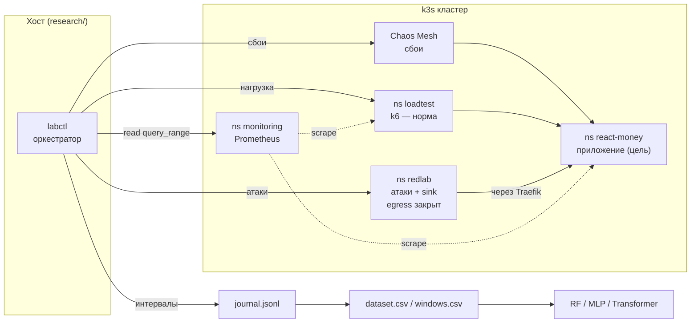
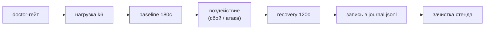

# Обнаружение атак vs сбоёв в Kubernetes по метрикам мониторинга (ML)

Исследовательский трек `research/ids-ml` — воспроизводимый стенд, который **автоматически**
генерирует размеченный датасет метрик мониторинга Kubernetes с тремя классами —
**норма / сбой / атака** — и сравнивает ML-детекторы (Random Forest, MLP, Transformer),
способные **отличать атаку от штатного сбоя**, а не только находить отклонение от нормы.

> **Контекст — авторизованное исследование безопасности.** Все сценарии запускаются только
> против собственного приложения `react-money` на собственном изолированном k3s-стенде, в
> выделенном namespace `redlab` с закрытым выходом в интернет. Цель — не компрометация, а
> генерация телеметрии для обучения детекторов.

Трек физически изолирован от дипломной работы: весь код и данные — в каталоге `research/`,
файлы диплома (`backend/`, `frontend/`, `k8s/`, `scripts/`) не изменяются.

---

## Содержание

1. [Научная задача и новизна](#1-научная-задача-и-новизна)
2. [Архитектура](#2-архитектура)
3. [Изоляция и безопасность стенда](#3-изоляция-и-безопасность-стенда)
4. [Оркестратор labctl](#4-оркестратор-labctl)
5. [Каталог сценариев](#5-каталог-сценариев)
6. [Признаки и форматы датасета](#6-признаки-и-форматы-датасета)
7. [Пайплайн генерации данных](#7-пайплайн-генерации-данных)
8. [Модели и план эксперимента](#8-модели-и-план-эксперимента)
9. [Статус проекта](#9-статус-проекта)
10. [Результаты на данный момент](#10-результаты-на-данный-момент)
11. [Воспроизводимость](#11-воспроизводимость)
12. [Ограничения](#12-ограничения)
13. [Дорожная карта](#13-дорожная-карта)
14. [Соответствие MITRE ATT&CK](#14-соответствие-mitre-attck)
15. [Структура каталога](#15-структура-каталога)

---

## 1. Научная задача и новизна

Классические детекторы аномалий по метрикам инфраструктуры не различают **причину**
отклонения. Всплеск задержки, рост ошибок или насыщение CPU может быть вызван как штатным
**сбоем** (деградация сети до БД, падение пода, пик легитимной нагрузки), так и **атакой**
(перебор паролей, флуд на API, SQL-инъекции). Детектор, обученный на «норма vs аномалия»,
даёт много ложных тревог на обычных сбоях и потому непригоден для SOC.

**Цель** — методика генерации размеченных данных и экспериментальное сравнение моделей,
различающих **три** класса.

**Новизна:**

- Единая методика генерации данных, где каждый класс порождается **признанным инструментом
  своего домена**: норма — k6, сбой — Chaos Mesh (CNCF), атака — профильные утилиты, с
  привязкой к **MITRE ATT&CK for Containers**.
- Автоматическая разметка по временным окнам прогонов — без ручной аннотации.
- Явная метрика качества **false-attack rate** — доля окон класса «сбой», ошибочно помеченных
  «атакой», которой нет в работах по детекции «норма vs аномалия».

---

## 2. Архитектура



**Поток данных:** `labctl scenario run` запускает фон нормы (k6) + целевой сценарий
(сбой Chaos Mesh **или** атаку Job в `redlab`), фиксирует интервал в `journal.jsonl` →
`labctl dataset build` выгружает метрики из Prometheus, нарезает на окна, размечает по
журналу → `dataset.csv` (агрегаты) и `windows.csv` (последовательности) → обучение моделей.

---

## 3. Изоляция и безопасность стенда

| Аспект | Значение |
|---|---|
| Namespace атак | `redlab` (создаётся `labctl init`) |
| Сетевая политика | `redlab-egress-lockdown`: egress только к DNS, `react-money`, Traefik, sink |
| Выход в интернет из атак | **запрещён физически** (проверка `labctl doctor --egress-test`) |
| Цель атак | `react-money` — неизменное приложение |
| Жёсткие лимиты Job'ов | `activeDeadlineSeconds` + `resources.limits` (CPU/mem) |
| Продакшн | на другой машине, **не затрагивается** |
| Секреты/креды | из Secret/ConfigMap, без зашивки в манифесты |

Инвариант: трек **читает** из чужих namespace'ов (Prometheus, состояние приложения) и
**пишет** только в свои `research/` и `redlab`.

---

## 4. Оркестратор labctl

CLI на Python 3 (stdlib + yaml), стилистически повторяет дипломный `scripts/chaos_run.py`.
Тяжёлые ML-зависимости — только на этапе обучения (на отдельной машине), не на k3s-узле.

| Команда | Назначение |
|---|---|
| `labctl init` | создать ns `redlab` + NetworkPolicy изоляции |
| `labctl doctor [--egress-test]` | проверка: ветка, kubectl, Prometheus, приложение, изоляция |
| `labctl scenario list` | список сценариев (класс, инструмент, длительность, ATT&CK) |
| `labctl scenario run <name>\|all [--repeat N --seed S]` | прогон(ы); `--repeat` варьирует интенсивность |
| `labctl scenario status` | что запущено сейчас (нагрузка, Chaos, Job'ы redlab) |
| `labctl scenario stop` | идемпотентная зачистка стенда |
| `labctl dataset build` | собрать `dataset.csv` + `windows.csv` из Prometheus по журналу |

**Жизненный цикл одного прогона:**



Гарантии: `doctor` обязателен перед запуском (R-2); `end_ts` пишется в `finally` — интервал
не теряется даже при сбое (R-1); `scenario stop` чистит только свои объекты по метке
`labctl-run` (R-4).

---

## 5. Каталог сценариев

Каждый сценарий в `research/scenarios/` — Chaos Mesh CRD (класс «сбой») или Job-манифест
(класс «атака»), с русской шапкой-комментарием. Имя: `NN-<class>-<slug>.yaml`.

| № | Класс | Сценарий | Инструмент | ATT&CK | Ожидаемый след |
|---|---|---|---|---|---|
| 00 | норма | Эталонная нагрузка 100 rps | k6 | — | rps≈100, метрики в норме |
| 01 | норма | Flash-crowd (легитимный наплыв) | k6 (высокий rate) | — | ↑↑ rps, ↑ соединения, но 2xx |
| 10 | сбой | Задержка backend→postgres +300мс | Chaos Mesh NetworkChaos | — | ↑ latency, ↑ соединения, ↓ rps |
| 11 | сбой | Убийство пода backend | Chaos Mesh PodChaos | — | ↓ готовность, рестарт (быстрый) |
| 12 | сбой | CPU-стресс backend | Chaos Mesh StressChaos | — | ↑ CPU, ↑ реплики HPA |
| 14 | сбой | Шторм 401 (протухшие токены клиентов) | k6 (невалидный JWT) | — | ↑ rps 401/403 (штатный трафик) |
| 20 | атака | Перебор паролей на `/api/auth/login` | curl (password spray) | T1110 | ↑ rps 401/403 |
| 21 | атака | Флуд-DDoS на API | k6 (агрессивный) | T1499 | ↑↑ rps, ↑ соединения |
| 22 | атака | Сканирование SQL-инъекций | sqlmap | T1190 | ↑ rps 5xx, ↑ нагрузка на БД |

**Ключевые пары «сбой/норма ↔ атака»** — одинаковый след в метриках, разная причина; именно
их учится различать модель:

- **flash-crowd (норма) ↔ флуд (атака)** — оба дают резкий скачок rps и соединений; при flash-crowd
  ответы успешны (2xx, латентность в норме), при флуде растут ошибки/таймауты. Классическая
  трудная пара «легитимный наплыв vs DDoS».
- **authfail (сбой) ↔ brute-force (атака)** — оба дают всплеск 401; сбой авторизации размазан
  широким штатным потоком по API, brute-force узко долбит `/api/auth/login` перебором.
- **netdelay (сбой) ↔ флуд (атака)** — оба грузят задержку/соединения, но при флуде RPS растёт,
  при netdelay падает.

> Двойник-сбой для SQLi (устойчивый всплеск 5xx) отложен: на данном стенде отказ БД приводит к
> зависанию запросов (499/таймаут), а не к 500 — приложение не падает быстро; HTTPChaos (прямая
> подмена кода ответа) на k3s не инжектится. Требует HTTPChaos-совместимого CNI или app-level
> fault injection — в дорожной карте.

При `--repeat N` каждый сценарий гоняется N раз с рандомизацией интенсивности (rate нагрузки,
задержка/длительность netdelay, workers/load CPU, rate/длительность флуда, длительность
brute/sqli) — детерминированно по `--seed`.

---

## 6. Признаки и форматы датасета

Метрики выгружаются из Prometheus, режутся на скользящие окна (по умолчанию **30 с, шаг 10 с**,
выборка 10 с). Собирается **21 серия** метрик:

| Группа | Серии |
|---|---|
| HTTP-трафик | `rps_total`, `rps_4xx`, `rps_5xx`, `rps_401_403`, `err_pct` |
| Задержки | `lat_mean_s`, `lat_p95_s`, `req_p99_s` |
| Соединения | `open_conns` |
| Ресурсы | `cpu_cores`, `cpu_pct_req`, `mem_bytes` |
| Оркестрация | `hpa_replicas`, `ready_backend`, `restarts` |
| База данных | `pg_up`, `pg_tps`, `pg_active`, `pg_rollbacks` |
| Сеть | `net_tx_bytes`, `net_rx_bytes` |

Из одного прогона формируются **два согласованных артефакта**:

| Файл | Содержание | Для модели |
|---|---|---|
| `dataset.csv` | по каждому окну 5 агрегатов на серию (mean/max/min/p95/наклон) → **105 признаков** | Random Forest, MLP |
| `windows.csv` | те же окна как последовательности (T×F, 18 отсчётов × 21 метрика) | Transformer |

Служебные колонки: `window_start, window_end, run_id, scenario, class, technique, boundary`.
Оба артефакта размечены одинаково и делятся по одним и тем же прогонам — сравнение честное.

---

## 7. Пайплайн генерации данных

`labctl dataset build`:

1. Читает `journal.jsonl` (интервалы всех прогонов).
2. Выгружает `query_range` по каждой серии за период каждого прогона (с запасом на контекст).
3. Нарезает на скользящие окна `W`/шаг `S`.
4. Размечает окно по перекрытию с интервалом воздействия: класс — если центр окна попал в
   `[start_ts, end_ts]`, иначе `norm`; частичное перекрытие помечается `boundary=1`.
5. Пишет `dataset.csv` (агрегаты) и `windows.csv` (последовательности).

**Детерминизм (R-10):** повторный `dataset build` по тому же журналу даёт идентичный результат.
**Без утечки (R-12):** разбиение train/test делается **по прогонам (`run_id`)**, а не по окнам —
соседние окна одного прогона почти идентичны, их попадание в train и test одновременно
завысило бы точность.

---

## 8. Модели и план эксперимента

| Модель | Тип | Вход |
|---|---|---|
| Random Forest | ансамбль | агрегаты окна (105 признаков) |
| MLP | нейросеть | агрегаты окна |
| Transformer | модель последовательностей | сырьё T×F |

- **Размеры датасета:** 50 / 75 / 100% обучающей части — проверить, с какого объёма Transformer
  окупается относительно RF. Тестовая выборка **фиксирована**.
- **Сплит по прогонам**, несколько random seed на комбинацию «модель × размер».
- **Метрики:** precision/recall/F1 по классам (macro/weighted), матрица ошибок 3×3,
  **false-attack rate**, задержка обнаружения; для RF — важность признаков.
- **Гипотеза:** на малых данных выигрывает RF; Transformer догоняет/обгоняет на 100%,
  особенно на медленных атаках, где важна динамика во времени.

---

## 9. Статус проекта

| Этап | Содержание | Статус |
|---|---|---|
| **M0** | Изоляция: ветка, каркас, ns `redlab`, NetworkPolicy, `doctor` | ✅ готово |
| **M1** | Норма (k6) + сбои (Chaos Mesh), журнал прогонов | ✅ готово |
| **M2** | Атаки (brute-force, флуд, SQLi) в `redlab`, интеграция в labctl | ✅ готово |
| **M3** | `series.py`, `dataset build`, разметка, детерминизм | ✅ готово |
| **M3.5** | Массовый сбор: `--repeat`/рандомизация, агрегат `min` | 🔄 идёт (105 прогонов) |
| **M4** | RF/MLP/Transformer × 50/75/100%, метрики, отчёт | ⏳ следующий |
| **M5** | Материалы для статьи: таблицы/графики, финальный прогон | ⏳ |

---

## 10. Результаты на данный момент

Первый полный **3-классовый датасет** (по одному прогону на сценарий, 84 признака до
добавления `min`): **339 окон**, 7 прогонов.

| Показатель | Значение |
|---|---|
| Окон | 339 |
| Классы | норма = 201 (59%), сбой = 90 (27%), атака = 48 (14%) |
| Пограничных окон (`boundary=1`) | 36 |
| Пропусков в данных | 0% |

**Сигнал атак** (пик во время воздействия, проверено на стенде):

| Атака | ATT&CK | Ключевой след |
|---|---|---|
| brute-force | T1110 | rps 401/403 ≈ 186 |
| флуд | T1499 | rps_total ≈ 3118, соединений ≈ 1112 |
| SQLi-скан | T1190 | rps 5xx ≈ 144, pg_tps ≈ 249 |

**Сигнал сбоёв** (пик во время воздействия):

| Сбой | Ключевой след |
|---|---|
| netdelay | p95 задержка 0.095 → 5.0 с; соединений 2 → 1501 |
| cpu-stress | CPU 0.10 → 0.69 ядра; реплик HPA 2 → 5 |
| kill-backend | почти без следа (self-healing ~6 с — см. ограничения) |

> В работе идёт массовый сбор (15 прогонов на сценарий, рандомизация интенсивности) для
> получения обучающего датасета на тысячи окон и корректного сплита по прогонам.

---

## 11. Воспроизводимость

Выполняется на k3s-узле (оркестратор — stdlib-only). ML-этап — на машине с pandas/numpy/sklearn.

```bash
git checkout research/ids-ml
cd research
python3 labctl.py init                    # изоляция: ns redlab + NetworkPolicy
python3 labctl.py doctor --egress-test    # проверить изоляцию (egress наружу закрыт)
python3 labctl.py scenario run all --repeat 15 --seed 42   # массовый сбор
python3 labctl.py dataset build           # dataset.csv + windows.csv
```

Требования на узле: `kubectl` c доступом к кластеру (`KUBECONFIG`), Python 3 + PyYAML,
работающий стек `monitoring` (Prometheus) и приложение `react-money`.

---

## 12. Ограничения

1. **Класс «атака» меньше остальных** — атаки короче сбоёв; решается массовым сбором с
   рандомизацией и повторами.
2. **kill-backend почти невидим** — замена пода поднимается за ~6 с, короткий провал не
   попадает в замеры раз в 10 с; частично лечится агрегатом `min` и более частым scrape.
   Одновременно это демонстрация эффективности self-healing.
3. **Один узел, одно приложение** — обобщение на другие сервисы требует проверки.
4. **Приложение реально не инъектируется** (параметризованные запросы) — для SQLi собирается
   наблюдаемый след сканера, а не результат эксплуатации (это и требуется).

---

## 13. Дорожная карта

- [x] M0–M3: изоляция, оркестратор, сценарии, сборка датасета
- [x] M3.5: сбои-двойники (flash-crowd, authfail 401), рандомизация, `min`-агрегат
- [🔄] Массовый сбор: 9 сценариев × 15 прогонов (135), рандомизация интенсивности
- [ ] M4: RF/MLP/Transformer × 50/75/100%, метрики, матрицы ошибок, важность признаков
- [ ] M5: таблицы/графики и текст для статьи
- [ ] Двойник-сбой для SQLi (устойчивый 5xx) — HTTPChaos-совместимый CNI / app-level fault
- [ ] Расширение: криптоджекинг (T1496), эксфильтрация (T1048) — метрики уровня узла и сети

---

## 14. Соответствие MITRE ATT&CK

| Техника | ID | Реализация на стенде |
|---|---|---|
| Brute Force | T1110 | password spray на `/api/auth/login` (curl) |
| Endpoint Denial of Service | T1499 | флуд-поток запросов на API (k6) |
| Exploit Public-Facing Application | T1190 | сканирование SQL-инъекций (sqlmap) |
| Resource Hijacking *(план)* | T1496 | криптоджекинг-профиль нагрузки |
| Exfiltration Over Alternative Protocol *(план)* | T1048 | объёмный egress на внутренний sink |

---

## 15. Структура каталога

```
research/
├── DOCUMENTATION.md            ← этот файл
├── TZ.md                       техническое задание
├── RULES.md                    правила разработки и изоляции
├── THREAT-MODEL.md             сценарий → техника → инструмент → след
├── DATASET-CARD.md             характеристики собранного датасета
├── labctl / labctl.py          оркестратор (bash-обёртка + Python)
├── series.py                   словарь метрик Prometheus
├── scenarios/                  сценарии норма/сбой/атака
│   ├── 00-norm-baseline.yaml
│   ├── 01-norm-flashcrowd.yaml
│   ├── 10-fault-netdelay.yaml
│   ├── 11-fault-kill-backend.yaml
│   ├── 12-fault-cpu-stress.yaml
│   ├── 14-fault-authfail.yaml
│   ├── 20-attack-bruteforce.yaml
│   ├── 21-attack-flood.yaml
│   └── 22-attack-sqli.yaml
├── k8s/
│   ├── redlab-namespace.yaml
│   └── redlab-networkpolicy.yaml
├── journal.jsonl               журнал прогонов (версионируется)
├── dataset.csv                 агрегаты окон (в .gitignore — производное)
└── windows.csv                 последовательности (в .gitignore — производное)
```
