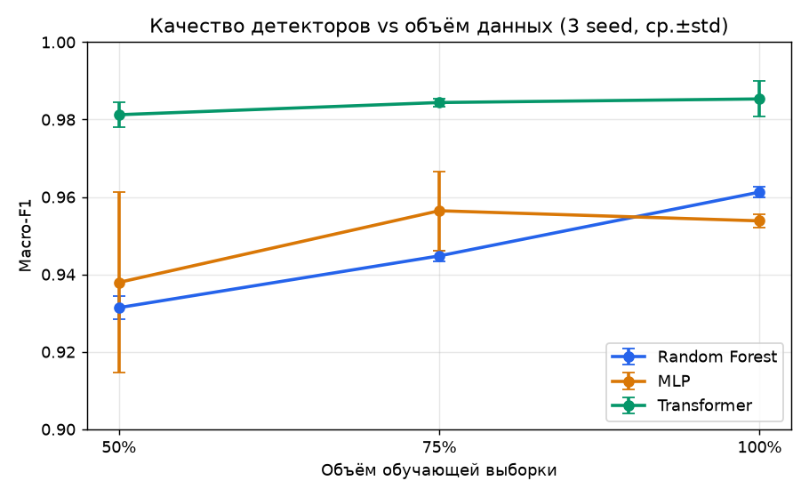
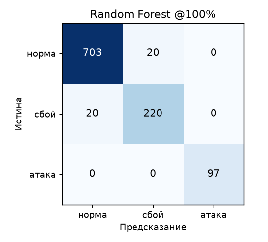
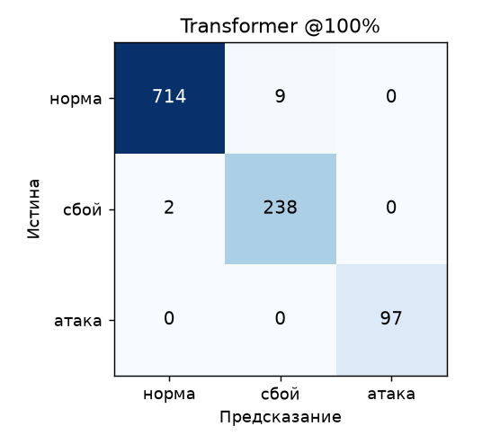

# Результаты M4 — сравнение детекторов норма/сбой/атака

Датасет: 6030 окон, 105 признаков, 135 прогонов (9 сценариев × 15). Сплит **по прогонам** (27 прогонов в фиксированном тесте, 1060 окон), обучение на 50/75/100% пула прогонов, 3 seed на конфигурацию. Пограничные окна исключены из train.

## Сводная таблица (Macro-F1, ср.±std)

| Модель | 50% | 75% | 100% | false-attack rate | attack-recall |
|---|---|---|---|---|---|
| Random Forest | 0.931±0.003 | 0.945±0.001 | 0.961±0.001 | 0.000 | 1.00 |
| MLP | 0.938±0.023 | 0.956±0.010 | 0.954±0.002 | 0.000 | 1.00 |
| Transformer | 0.981±0.003 | 0.984±0.001 | 0.985±0.005 | 0.000 | 1.00 |

## Ключевые выводы

1. **Главная задача решена у всех моделей:** `false-attack rate = 0` и `attack-recall ≈ 1.0` — сбои никогда не принимаются за атаки, все атаки пойманы. Это ответ на вопрос статьи: на полном векторе признаков supervised-детектор различает то, что одиночный порог путает.
2. **Transformer — лучший** (0.985 на 100%), обгоняет Random Forest (0.961) и MLP (0.954) на **всех** объёмах. Выигрыш — за счёт временной динамики окна.
3. **Гипотеза уточнена:** ожидали преимущество RF на малых данных и «догоняющий» Transformer на 100%. По факту Transformer лучше уже на 50% — последовательность даёт ему преимущество сразу.
4. **Остаточная ошибка — только «норма ↔ сбой»**; класс «атака» отделяется практически идеально (см. матрицы ниже).

## Матрицы ошибок (100% данных)

Строки — истинный класс, столбцы — предсказание.

| Random Forest | Transformer |
|---|---|
|  |  |

- **Random Forest @100%** F1 по классам: норма 0.972, сбой 0.917, атака 1.000
- **Transformer @100%** F1 по классам: норма 0.992, сбой 0.977, атака 1.000

## Важность признаков (Random Forest, топ-12)

| Признак | Важность |
|---|---|
| `net_rx_bytes_p95` | 0.0531 |
| `net_rx_bytes_max` | 0.0489 |
| `net_rx_bytes_mean` | 0.0385 |
| `lat_mean_s_min` | 0.0356 |
| `mem_bytes_p95` | 0.0308 |
| `pg_tps_max` | 0.0295 |
| `mem_bytes_max` | 0.0285 |
| `rps_total_p95` | 0.0280 |
| `net_tx_bytes_max` | 0.0264 |
| `net_tx_bytes_p95` | 0.0262 |
| `lat_mean_s_max` | 0.0262 |
| `lat_mean_s_p95` | 0.0251 |

Лидируют сетевой трафик (`net_rx/tx_bytes`), задержка (`lat_mean_s`), память, `pg_tps`, `rps_total` — метрики, отличающие атаки и профиль нагрузки.

## Метрики и методология

- **Macro-F1** — среднее F1 по трём классам (не завышается доминирующей нормой).
- **false-attack rate** — доля окон «сбой», предсказанных «атака» (ключевая метрика новизны).
- **attack-recall** — доля атак, распознанных как атака.
- Сплит **по `run_id`** исключает утечку между train/test; тест фиксирован для всех моделей и размеров.
- Воспроизведение: `python ml/train.py --models rf mlp transformer --seeds 3`.

## Ограничения

- Класс «атака» — меньшинство (~11%); компенсируется взвешиванием классов.
- Разделение «атака vs сбой» на текущем наборе почти идеальное — атаки дают сильную сетевую сигнатуру; более скрытные атаки (low-rate) — направление дальнейшей работы.
- Двойник-сбой для SQLi (устойчивый 5xx) и метрики detection latency — в дорожной карте.